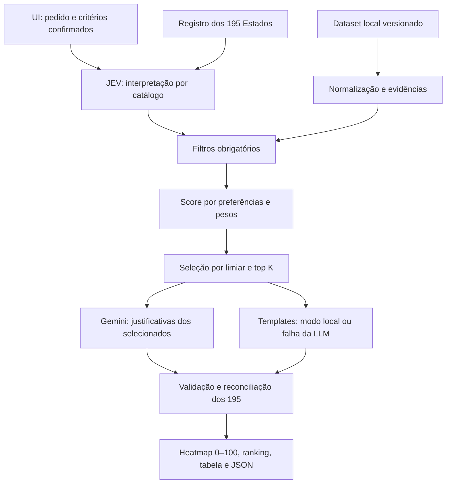

# Arquitetura JEV — ranking de afinidade com o pedido

Decisão de escopo em 05/10/2026. Arquitetura-alvo; implementação pendente.
O produto apresenta afinidade dos países com os critérios do pedido em um
heatmap de score 0–100. O score é calculado pela JEV com dados e regras
versionados. Gemini explica somente os melhores candidatos, a partir das
mesmas evidências; não escolhe países nem altera seus scores ou posições.

## Entrada e interpretação

Texto livre é interpretado por regras, sinônimos e catálogo pequeno de critérios
suportados. A UI exibe a interpretação, requisitos obrigatórios, preferências e
pesos antes de executar. Ambiguidade ou termo não suportado exige esclarecimento;
não há promessa de interpretação universal nem chamada LLM para essa etapa.

“Praia” precisa de definição mensurável: litoral, praia turística ou adequação
sazonal são atributos distintos. “Inglês oficial” pode ser requisito, enquanto
“facilidade de comunicação em inglês” é preferência e exige outro dado.
Dados de país não garantem condições de toda cidade ou região.

## Responsabilidades e dependências

| Componente planejado | Papel |
| --- | --- |
| country_registry | 193 membros ONU + Santa Sé/VAT e Palestina/PSE, ISO/M49 e versões |
| affinity_schema | Pedido, critérios, evidências, score, seleção, justificativa e execução |
| criteria_catalog / input_parser | Critérios suportados, sinônimos, unidades, operadores, pesos e ambiguidades |
| data/evidence_service | Dataset local, proveniência e normalização; conectores só se aprovados em #13 |
| affinity_ranker | Requisitos, score determinístico, cobertura dos dados e desempate estável |
| jev_service | Orquestração, seleção, limites, cache, progresso e reconciliação |
| explanation_client | Gemini restrito aos selecionados, com evidências e resposta estruturada |
| UI / renderer | Revisão do pedido, heatmap, ranking, status e exportação |

A UI chama a JEV. O ranker depende dos contratos e dados, sem SDK de LLM ou UI.
O adaptador de explicação recebe somente os selecionados e não escreve no score.
A fundação (#14) é offline; dados (#13) e contratos precedem o motor (#15), que
precede a interface (#16). A avaliação (#17) começa com protocolo e fixtures.
Não há necessidade aprovada de microserviço, banco servidor, embeddings ou Docker.

## Invariantes

- Resposta final representa exatamente os 195 Estados uma vez; chamadas LLM
  incluem apenas o subconjunto selecionado, sem obrigação de explicar todos.
- `affinity_score` é finito em [0,100] para `ranked`; não é probabilidade,
  precisão ou porcentagem de população. Scores de pedidos diferentes não são
  diretamente comparáveis. O `heat_score` antigo permanece identificado como legado.
- Exclusão por requisito, dados insuficientes e erro técnico têm score `null`;
  ausência de dados não vira zero. Baixa afinidade válida pode ter score zero.
- Pontuação identifica critérios, pesos, valores, contribuições e evidências.
- Seleção tem limiar, limite e desempate explícitos; não preenche top K artificialmente.
- LLM não acrescenta países, fatos sem evidência, scores ou reordenação.
- Falha da justificativa preserva o ranking e usa template identificado.
- `local_only` impede rede na aquisição e explicação, usando templates.
  O navegador do MVP ainda usa CDN; UI integralmente offline exige geometrias locais.
- Cache/retomada não misturam pedidos, dados, regras, prompts, modelos ou sessões.

## Estado executável e migração

O código atual continua Streamlit → Gemini → HeatmapResponse → Plotly: o modelo
produz países e scores qualitativos. O parser, dataset e ranking da JEV ainda
não existem. Esta entrega muda documentação e backlog, sem alterar execução.
As dependências e os testes existentes pertencem ao MVP; não comprovam ranking,
redução de custo ou qualidade das justificativas futuras.

Decisão: [ADR 0003](docs/adr/0003-affinity-ranking.md).
Contratos: [JEV_DESIGN.md](docs/JEV_DESIGN.md).
Backlog: [JEV_IMPLEMENTATION_PLAN.md](docs/JEV_IMPLEMENTATION_PLAN.md).
Código atual: [MVP](docs/MVP_LEGACY.md). Propostas anteriores: [histórico](docs/legacy/README.md).
