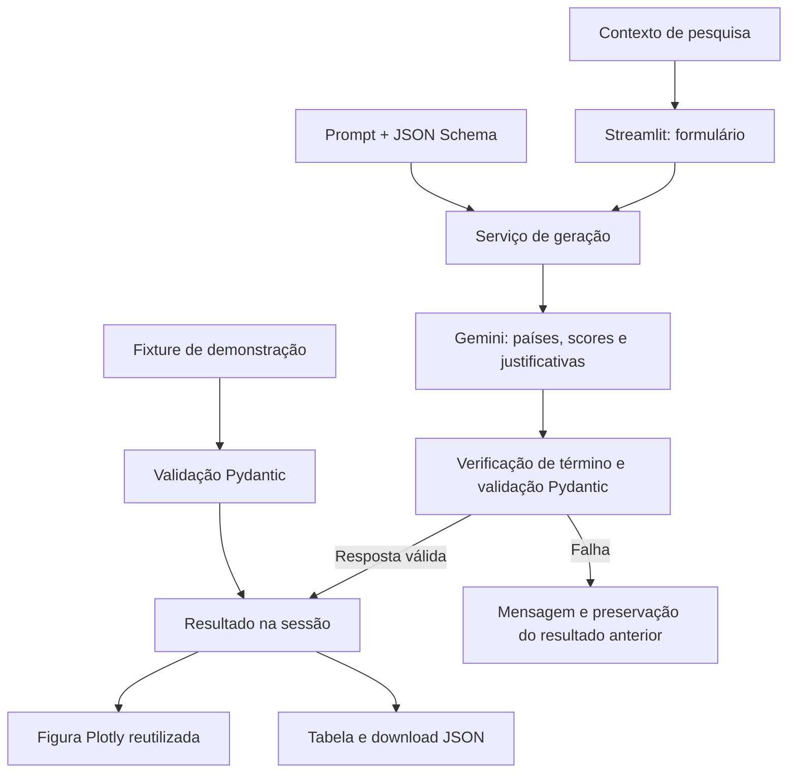
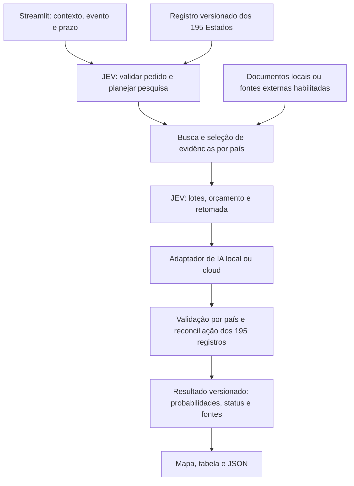

# Arquitetura e Fluxo de Dados

## Estado desta revisão

Análise da `develop` no commit `bc9360b`, em 02/10/2026. A existência de código
nessa branch não comprova sua implantação em um ambiente publicado.

**Papel confirmado pelo responsável:** JEV deve participar da arquitetura com
IA, organizar e otimizar a busca a partir do contexto e retornar estimativas de
probabilidade para todos os 195 Estados do escopo adotado. **O usuário informa o
evento e o prazo**; a IA não os escolhe silenciosamente. A expansão da sigla não
foi fornecida e não é necessária para definir essa responsabilidade funcional.

Esse é o objetivo da evolução. Não há ainda componente executável independente
denominado JEV: o código analisado usa Gemini para scores qualitativos, validação
local e mapa. As seções 1–5 abaixo descrevem esse estado atual.

A [ADR 0001](docs/adr/0001-jev-role-and-architecture.md) registra evidências,
alternativas e proposta de implementação para a [issue #8](https://github.com/felpzw/jev-global-heatmap/issues/8).
O [desenho detalhado](docs/JEV_DESIGN.md) define cobertura, contratos, busca,
estimativas, migração e avaliação. Ainda não há implementação dessa proposta.

## 1. Fluxo Principal
1. **Input UI:** Usuário insere o contexto/tema no `src/app.py`.
2. **LLM Service:** `src/services/llm_client.py` envia o prompt + input para a IA solicitando uma saída JSON estruturada.
3. **Data Parsing:** A resposta é validada via Pydantic para garantir que contenha a chave do país e o score numérico.
4. **Map Rendering:** `src/components/map_renderer.py` consome o JSON validado e monta uma figura `plotly.graph_objects.Choropleth`, sem um DataFrame intermediário.

## 2. Contrato de Dados (Pydantic Schema)
O modelo DEVE retornar um objeto `HeatmapResponse` com a chave `countries`,
contendo uma lista de objetos `CountryHeatmap` neste formato:
- `iso_alpha_3` (string): Código de 3 letras do país (Padrão ISO 3166-1 alpha-3. Ex: "BRA", "USA"). Essencial para o Plotly renderizar.
- `heat_score` (float): Valor numérico de 0.0 a 100.0 representando a intensidade.
- `context_summary` (string): Breve justificativa de 1 frase do score atribuído àquele país (usado no tooltip ao passar o mouse no mapa).

O schema rejeita campos extras, países duplicados, códigos inexistentes no catálogo
`pycountry`, valores não numéricos, infinitos/NaN e justificativas vazias ou maiores
que 300 caracteres. Uma lista vazia representa contexto insuficiente; países ausentes
não recebem score zero. O limite é de 249 entradas.

O serviço usa Gemini Structured Outputs e revalida o JSON localmente antes de
retorná-lo. O timeout HTTP é de 60 segundos, sem repetição automática de chamadas.
Erros do provedor são convertidos em mensagens sem credenciais ou respostas brutas.
Antes de validar o JSON, o serviço exige uma resposta concluída (`finish_reason=STOP`).
Gerações interrompidas, bloqueadas ou sem candidatos não substituem o resultado
anterior, mesmo que o trecho retornado seja JSON válido.

## 3. Interface e avaliação

- A UI só chama o serviço no envio do formulário; entradas vazias são barradas.
- `session_state.mapping` guarda resposta, contexto e origem (`gemini`/`demo`).
  Reruns não disparam consultas. Falhas mantêm o resultado anterior identificado.
- `plot_heatmap` valida dados, retorna `Figure` e não depende de Streamlit.
- A figura é construída ao salvar um resultado e reutilizada na própria sessão,
  sem cache global de contextos. Uma revisão derivada dos dados permite preservar
  o enquadramento em reruns e reiniciá-lo quando o resultado muda.
- O mapa usa escala fixa 0–100 e cinza para ausência de dados. A geografia de
  base é carregada pelo navegador a partir do CDN do Plotly.
- `src/services/prompts.py` é a fonte executável dos prompts. O refinado pede
  uma amostra de até 40 países para reduzir geração; isso é uma orientação,
  não uma garantia de cobertura mundial nem uma otimização medida.
- `evaluate_prompts.py` separa fixtures offline de comparação real, incluindo
  tempos, distribuição e respostas para revisão humana. Não há busca na web
  nem validação factual automatizada neste MVP.

## 4. Responsabilidades e limites

| Parte | Responsabilidade implementada | Limite |
| --- | --- | --- |
| `src/app.py` | Entrada, envio explícito, feedback, estado, tabela e download | Sem histórico persistente; recarregar pode limpar a sessão |
| `src/services/prompts.py` | Instruir critério comparável, seleção geográfica, scores e justificativas | Instruções não garantem que o modelo conheça ou siga fatos corretos |
| `src/services/llm_client.py` | Configurar Gemini, enviar contexto/schema, verificar término e tratar erros | Provedor único, timeout de 60 s, uma tentativa; sem pesquisa externa |
| `src/services/schema.py` | Rejeitar JSON/ISO/tipos/limites/duplicatas inválidos | Não valida a veracidade da justificativa nem a adequação do score |
| `src/components/map_renderer.py` | Revalidar os dados e renderizar países/cores/tooltips | Não calcula scores, não seleciona a amostra e não mede confiança |
| `evaluate_prompts.py` | Avaliar contrato/distribuição e comparar prompts quando executado com API real | Não verifica automaticamente fatos; execução offline usa dados fictícios |

A seleção dos países e os scores são produzidos pelo modelo em uma única geração.
Não existe fórmula de pontuação implementada, distribuição probabilística da
amostra, margem de erro, ponderação populacional ou garantia de representatividade.
O termo “amostragem” descreve aqui um subconjunto de países retornado pelo modelo.

O cliente limita a entrada a 4.000 caracteres e a geração a 8.192 tokens. O prompt
prefere até 40 países, mas o contrato aceita até 249. Esses limites não constituem
evidência de qualidade ou desempenho medido do modelo.

## 5. Uso e rastreabilidade

O comportamento atual permite exploração inicial de um tema, comparação visual
de estimativas qualitativas e demonstração do fluxo geográfico. Por exemplo, um
tema sobre adoção de veículos elétricos pode resultar em países com scores e uma
justificativa curta; não resulta em percentuais oficiais ou dados atuais coletados.
Na evolução JEV, esses temas deverão virar eventos verificáveis com prazo,
como um limiar de adoção especificado pelo usuário para uma data futura.

A sessão guarda contexto, origem (`gemini`/`demo`), resposta e figura. O download
contém somente `countries`: não inclui contexto, modelo, versão do prompt,
timestamp ou fontes. Portanto, um JSON exportado isoladamente não permite
reproduzir todas as condições da geração. O relatório do avaliador real registra
mais contexto, mas não é um histórico automático das pesquisas feitas na UI.

Não há banco de dados, recuperação de documentos (RAG), busca na web, agente com
ferramentas ou treinamento de modelo próprio no fluxo atual. O transporte para
Gemini é externo; geometrias do mapa são carregadas pelo navegador via CDN.

## 6. Evolução prevista, ainda não implementada

A [issue #10](https://github.com/felpzw/jev-global-heatmap/issues/10) prevê runtime
local em Docker, adaptadores de geração e aba de modelos. O ponto de extensão é
a camada de serviços: manter contratos de domínio independentes do provedor,
isolando configurações, SDKs e motivos de término. `HeatmapResponse` permanece
como contrato legado; a JEV exige um contrato versionado de probabilidades,
conforme o desenho abaixo, sem reinterpretar `heat_score` como probabilidade.
Mapa e contrato não devem depender de Docker ou de qual modelo gerou os scores.

Uma geração local também precisará de validação; trocar o provedor não resolve
precisão factual. Provedor e modelo deverão acompanhar o resultado na sessão,
como já especificado na #10. Essa capacidade ainda não existe na versão analisada.

A [issue #4](https://github.com/felpzw/jev-global-heatmap/issues/4) continua sendo
o lugar da avaliação real de prompts. A #8 define o papel de JEV e a decisão
arquitetural; ela não substitui nem encerra o aceite empírico da #4.

## 7. Arquitetura-alvo da JEV — proposta

A JEV é proposta como serviço de aplicação dentro do projeto, acima dos adaptadores
de IA. Coordena evidências e inferência, mas não substitui o modelo nem a validação.
Não exige um novo microserviço. A busca é uma capacidade separada da geração:
modelo local não implica pesquisa externa e busca externa não implica modelo cloud.

O universo é **193 membros da ONU + Santa Sé e Estado da Palestina**, os dois
Estados observadores, conforme [ONU](https://www.un.org/en/about-us) e
[observadores](https://www.un.org/en/about-us/non-member-states). Não corresponde
ao catálogo inteiro de países e territórios aceito hoje por `pycountry`.

O resultado terá exatamente um registro por Estado e distinguirá probabilidade
estimada, evidência insuficiente, não aplicabilidade e erro técnico. Cobertura
de 195 registros não garante 195 estimativas numéricas justificáveis. Uma
probabilidade de zero não substitui ausência de evidência.

A saída será `P(evento ocorrer no país até o prazo | evidências disponíveis na
data de referência)`. Não é recomendação automática de uma ação, porcentagem
da população, confiança verbal da LLM ou normalização dos scores antigos.
As probabilidades dos diferentes países não precisam somar 100%.
