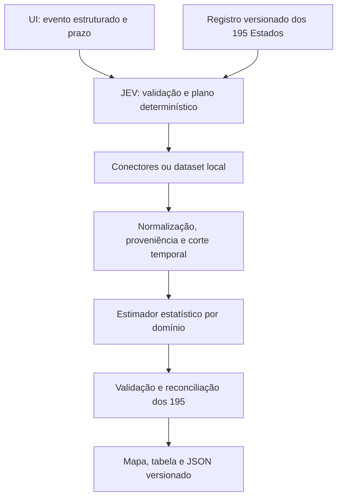

> Snapshot histórico substituído pela [ADR 0003](../adr/0003-affinity-ranking.md) em 05/10/2026. Planos e estados abaixo descrevem a decisão anterior.

# Arquitetura JEV sem LLM

Decisão de escopo em 05/10/2026. Arquitetura-alvo; ainda não implementada.
A JEV é um serviço de aplicação que organiza obtenção de dados, normalização,
estimativa estatística e apresentação para os 195 Estados do escopo.
O novo fluxo não faz chamadas a LLM e não depende de Gemini, SDKs de geração,
runtime local ou Docker de modelos.

## Entrada e interpretação

O usuário escolhe um domínio/evento suportado e informa indicador, unidade,
limiar, prazo e critério de resolução. Contexto textual pode acompanhar o pedido,
mas não escolhe silenciosamente fonte, método ou evento. O catálogo inicial
será definido na investigação de dados; não se promete previsão para qualquer tema.

Distinguir dados observados, score de regras e probabilidade de ocorrência futura.
Um número importado ou score normalizado não é automaticamente uma probabilidade.
A definição de previsão permanece P(evento em país até T | dados disponíveis em t0).

## Responsabilidades

| Componente previsto | Papel |
| --- | --- |
| country_registry | Registro dos 193 membros ONU + Santa Sé/VAT e Palestina/PSE, ISO/M49, versão e fontes |
| forecast_schema | Pedidos, observações/evidências, previsões e execuções versionadas |
| data/evidence_service | Leitura local ou consulta externa habilitada, normalização e proveniência |
| forecast_estimator | Método estatístico/baseline por domínio, com versão e parâmetros |
| jev_service | Validação, planejamento por regras, limites, progresso, cache, retomada e reconciliação |
| UI e renderer | Formulário estruturado, mapa/tabela, status e exportação |

São componentes planejados. Fonte e banco não estão escolhidos. Arquivos,
SQLite e DuckDB são candidatos de armazenamento, não requisitos aprovados.

## Direção das dependências

A UI chama `jev_service` com `ForecastRequest`; não consulta fontes nem calcula
probabilidades. O serviço depende dos contratos, do registro, das interfaces de
dados e do estimador. Conectores implementam a interface de dados; estimadores
consomem observações normalizadas, sem acesso direto à UI ou a SDKs de LLM.
A reconciliação valida `ForecastResponse` antes da apresentação/exportação.
O renderer consome resultados validados e não modifica estimativas.

A fundação (#14) pode ser validada offline sem Streamlit, Gemini ou banco.
A seleção de fontes e método (#13) precede sua integração no motor (#15);
a UI (#16) depende desse motor. A avaliação (#17) define o protocolo cedo.
`requirements.txt` ainda pertence ao MVP e inclui `google-genai`; sua presença
não é uma dependência aprovada da JEV. A migração de dependências acompanha
as entregas executáveis, sem remoção prematura do cliente atual.

## Invariantes

- Resposta final representa exatamente os 195 códigos do registro uma vez.
- estimated requer probabilidade finita em [0,1]; insufficient_evidence,
  not_applicable e error requerem null e justificativa. Erros técnicos indicam parcial.
- Ausência de dados não vira zero. Scores antigos não são convertidos em probabilidade.
- Toda estimativa identifica dados efetivamente usados, método e versões.
- local_only impede rede na aquisição e estimação; consulta externa é opção
  explícita e limitada. A UI integralmente offline exige geometrias locais (#16),
  pois o renderer do MVP ainda depende do CDN.
- Não há fallback para LLM. Explicações são templates com dados/método/fontes.
- t0/as_of limita dados e snapshots; revisões atuais não provam conhecimento histórico.
- Cancelamento e retomada não misturam pedidos, datasets ou versões.

## Estado executável e migração

O código atual continua Streamlit → Gemini → HeatmapResponse → Plotly.
A demonstração funciona sem chave; o mapa atual usa geometrias via CDN.
Nenhuma remoção de dependências ou migração de execução foi realizada nesta mudança.
Os 29 testes offline aprovados validam esse MVP, não a nova arquitetura.

A arquitetura do MVP está em [MVP_LEGACY.md](../MVP_LEGACY.md).
As propostas anteriores com LLM estão em [legacy](../legacy/README.md).
A decisão atual está na [ADR 0002](../adr/0002-jev-without-llm.md),
os contratos em [JEV_DESIGN.md](JEV_DESIGN_NO_LLM.md) e o backlog em
[JEV_IMPLEMENTATION_PLAN.md](JEV_IMPLEMENTATION_PLAN_NO_LLM.md).
